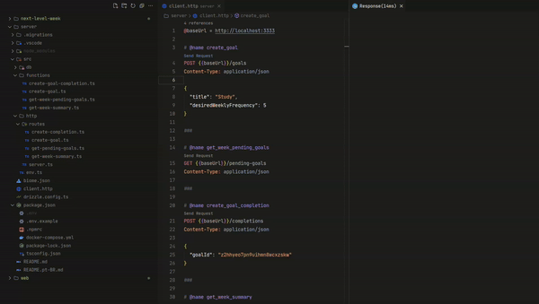

<h1 align="center">
    <br>
    NLW Pocket: JavaScript
</h1>

<p align="center">
  <a href="https://orm.drizzle.team">
    
  </a>
  <a href="https://nodejs.org">
    
  </a>
</p>

<div align="center">
  <details>
  <summary><b>Demo</b></summary>
  <div style="width: 90%;">
    
  </div>
  </details>
</div>

<br>

<div align="center">
  <h4 align="center">read in the language</h4>
  <a href="https://github.com/gbdsantos/next-level-week/blob/master/17-edition/server/README.pt-BR.md" hreflang="pt-br" alt="pt-br">🇧🇷 portuguese
  </a>
</div>

## About

17ª edition Next Level Week Pocket: JavaScript event by Rocketseat during 09, 10, 11 Semptember of the 2024.

## Getting Start

```Bash
# 1. Install dependencies
npm install

# 2. Create a new Docker environment
docker compose up -d

# 3. Run migrations
npx drizzle-kit migrate

# 4. Run seeds (OPTIONAL)
npm run seed

# 5. Generate migrations (OPTIONAL)
npx drizzle-kit generate

# View database tables
npx drizzle-kit studio
```

<br>

## Executed commands

```bash
# Create project
npm init -y

# Install TypeScript, Node.js types, and tsx
npm i typescript @types/node tsx -D

# Inicialize TypeScript
npx tsc --init

# Install Fastify
npm i fastify

# Install Biomejs
npm i -D --save-exact @biomejs/biome

# Install Drizzle ORM
npm i drizzle-orm 

# Install drizzle-kit
npm i drizzle-kit -D

# Install Zod
npm i zod

# Install postgres driver
npm i postgres

# Install parallel
npm i @paralleldrive/cuid2

# Install dayjs
npm i dayjs

# Install fastify-type-provider-zod
npm i fastify-type-provider-zod
```

<br>

## Local environment requirements

- Node.js >=20

## Technologies

- [Biome](https://biomejs.dev "Biomejs") - One toolchain for your web project. Format, lint, and more in a fraction of a second
- [Drizzle](https://orm.drizzle.team "Drizzle ORM - next gen TypeScript ORM") - JavaScript/TypeScript ORM (Object Relation Mapping)
- [Node.js](https://nodejs.org "Node.js") - JavaScript runtime environment / plataform

---

Made with ❤️ by **Guilherme Bezerra** 👋 [Get in touch!](https://www.linkedin.com/in/gbdsantos "LinkedIn - Guilherme Bezerra")