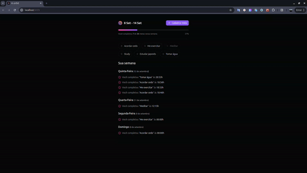

<h1 align="center">
    <br>
    in.Orbit
</h1>

<p align="center">
  <a href="https://nodejs.org">
    
  </a>
  <a href="https://react.dev">
    
  </a>
  <a href="https://tailwindcss.com">
    
  </a>
</p>

<div align="center">
  <details>
  <summary><b>Demo</b></summary>
  <div style="width: 90%;">
    
  </div>
  </details>
</div>

<br>

<div align="center">
  <h4 align="center">read in the language</h4>
  <a href="https://github.com/gbdsantos/next-level-week/blob/master/17-edition/web/README.pt-BR.md" hreflang="pt-br" alt="pt-br">🇧🇷 portuguese
  </a>
</div>

## About

Front-end web application made in 17ª edition Next Level Week Pocket: JavaScript event by Rocketseat during 09, 10, 11 Semptember of the 2024.

## Getting Start

```Bash
# 1. Install dependencies
npm install
```

<br>

## Executed commands

```bash
# Create project
npm create vite@latest

# Install Biomejs
npm i @biomejs/biome -D

# Install tailwindcss
npm install -D tailwindcss postcss autoprefixer

# Inicialize tailwindcss
npx tailwindcss init -p

# Install icons library lucide-react
npm i lucide-react

# Install tailwind-merge
npm i tailwind-merge

# Install tailwind-variants
npm i tailwind-variants

# Install @radix-ui/react-radio-group
npm i @radix-ui/react-radio-group

# Install @radix-ui/react-progress
npm i @radix-ui/react-progress

# Install @radix-ui/react-dialog
npm i @radix-ui/react-dialog

# Install TanStack Query
npm i @tanstack/react-query

# Install dayjs
npm i dayjs
```

<br>

## Local environment requirements

- Node.js >=20

## Technologies

- [Biome](https://biomejs.dev "Biomejs") - One toolchain for your web project. Format, lint, and more in a fraction of a second
- [Node.js](https://nodejs.org "Node.js") - JavaScript runtime environment / plataform
- [React](https://react.dev "React - The library for web and native user interfaces") - The library for web and native user interfaces
- [Tailwindcss](https://tailwindcss.com "Tailwindcss") - Utility-first CSS framework packed with inline classes
- [TanStack Query](https://tanstack.com/query/latest "TanStack Query - Powerful asynchronous state management for TS/JS, React, Solid, Vue, Svelte and Angular") - Powerful asynchronous state management for TS/JS, React, Solid, Vue, Svelte and Angular

---

Made with ❤️ by **Guilherme Bezerra** 👋 [Get in touch!](https://www.linkedin.com/in/gbdsantos "LinkedIn - Guilherme Bezerra")